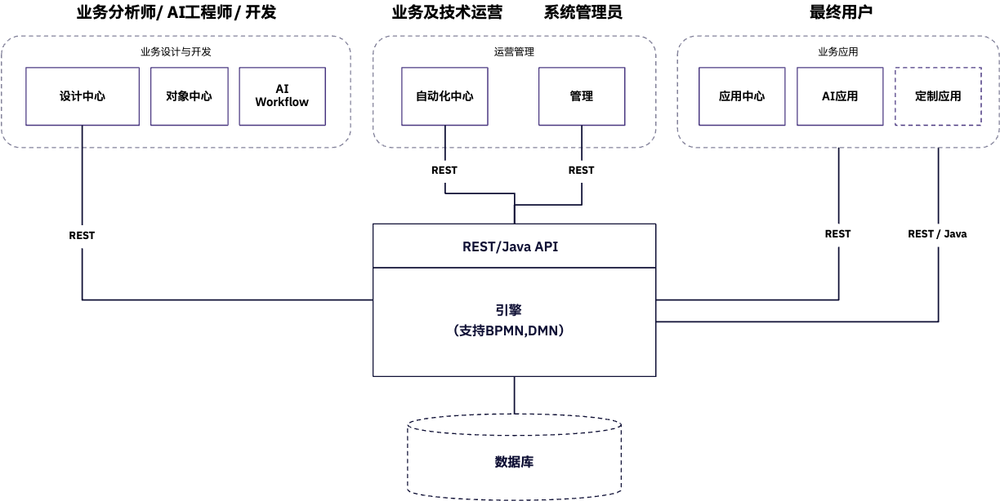

# 什么是ORION

ORION是一款面向Agentic AI时代的流程自动化与智能业务编排平台，致力于帮助企业构建具备智能感知、自主决策和持续演化能力的业务流程系统。

ORION核心内置一套强大的业务编排引擎，它源自于Camunda开源项目的技术分支，在继承其成熟稳定的流程执行能力基础上，进一步扩展了适应企业数字化转型与智能化演进的新能力。

作为Gartner提出的BOAT能力落地实践（Business Orchestration and Automation Technology），ORION将流程编排引擎、低代码应用开发、AI辅助开发与Agentic智能体编排能力深度融合，为业务与技术团队提供一个可协同、可扩展、可信任、可智能进化的统一平台。

<Note>
  “[**ORION**](https://zh.wikipedia.org/wiki/%E7%8D%B5%E6%88%B6%E5%BA%A7)”源自希腊神话中的猎人“猎户座”，也是夜空中最明亮、最易识别的星座之一。我们选择这个名字，寓意我们的产品正如猎户座一样，在复杂系统与混沌信息的宇宙中，指引方向、连接各方、洞察全局。
</Note>

## ORION的核心特性包括

设计、运行、体验、持续优化！

#### 设计

- 支持**BPMN2.0**和**DMN1.3**标准流程与决策建模
- 拖拽式界面构建流程、智能体、表单、页面、数据模型
- 使用AI开发助手，自然语言生成流程设计、脚本代码、表达式与规则

#### 运行

- 提供流程实例的实时监控、操作与审计，包括流程图可视化追踪、历史轨迹、变量查看等能力
- 支持运行中流程的挂起、终止、跳转、重试、修复、迁移等高级操作，增强流程韧性与运维能力

#### 体验

- 提供统一的任务中心，集中管理所有待办事项，打通多流程、多系统任务入口
- 内置 Copilot 智能助手，实时理解业务上下文，主动提供建议与辅助操作，实现任务处理与AI协同并行

ORION支持**SaaS、私有化部署与混合集成模式**，可广泛应用于不同行业的各类流程应用中（包括但不限于审批流、运维流、IoT自动控制、数据驱动任务、AI交互等场景），是企业迈向自动化与智能化的重要基础软件。

<Note>
  为了帮助你全面了解ORION，下面的示意图展示了ORION的核心组成部分以及一些典型的用户角色。
</Note>

