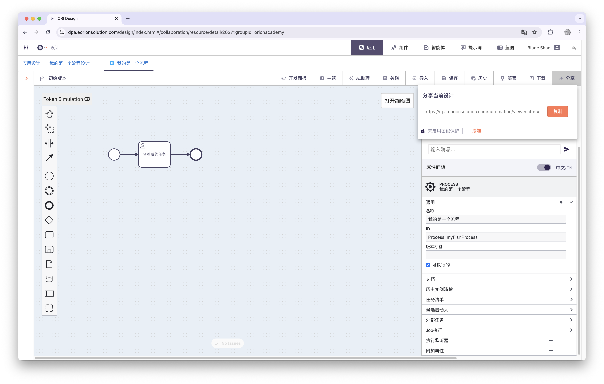
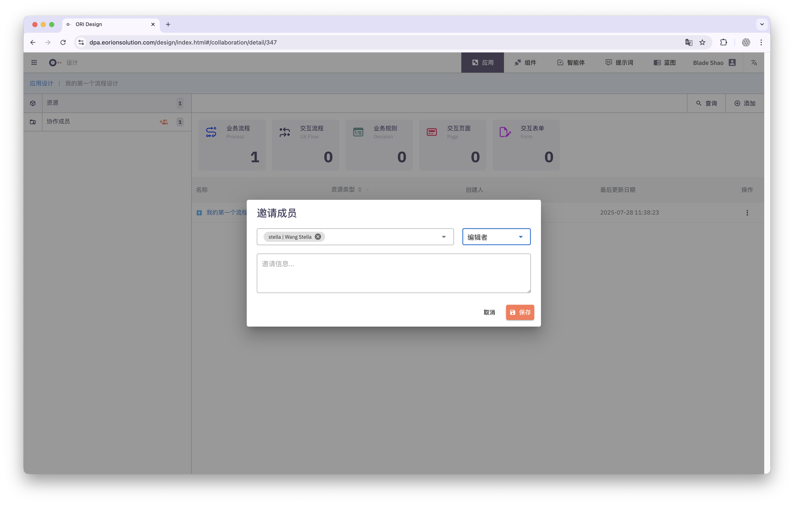

## 设计一个流程

在 ORION 中，设计流程是一项直观且高效的操作。请按照以下步骤完成你的第一个业务流程设计：

1. 进入设计中心：从系统主导航中点击 **设计中心**（Design Studio）入口，进入流程应用的设计工作区。
2. 创建一个项目：点击右上角的 **新建项目** 按钮，输入项目名称与描述。每个项目用于组织相关的流程与资源。

3. 创建一个业务流程：在项目中，点击 **新建流程**。你可以为流程设置名称、版本号，并选择流程类型（如普通流程、审批流程等）。

4. 绘制业务流程：进入流程编辑器后，你可以通过拖拽节点的方式绘制BPMN业务流程图。
5. 定义流程ID：流程 ID 是流程在系统内部的唯一标识。你可以在流程属性面板中自定义流程 ID，建议使用具有语义的命名方式，例如：**Process_employee_onboarding**

6. 保存流程：流程设计完成后，点击顶部工具栏的 **保存** 按钮，流程即被保存到当前项目中。你可以继续编辑、发布或测试此流程。

## 与团队的协作

你可以通过以下两种方式，与他人协同完成流程设计：

1. **生成分享链接**
   将流程图以链接形式分享给外部人员，点击即可查看，无需登录。

2. **邀请系统用户协作**
   将其他系统用户添加为协作者，共同编辑和管理流程项目。

## 部署并运行

TBD