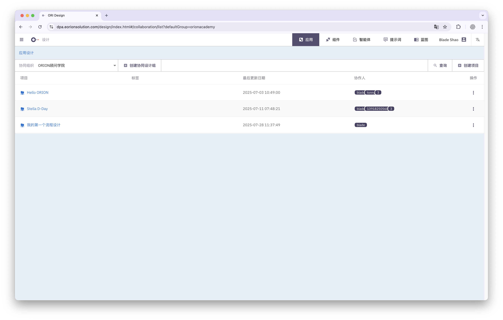

# 什么是ORION

ORION是一款面向Agentic AI时代的流程自动化与智能业务编排平台，致力于帮助企业构建具备智能感知、自主决策和持续演化能力的业务流程系统。

ORION核心内置一套强大的业务编排引擎，它源自于Camunda开源项目的技术分支，在继承其成熟稳定的流程执行能力基础上，进一步扩展了适应企业数字化转型与智能化演进的新能力。

作为Gartner提出的BOAT能力落地实践（Business Orchestration and Automation Technology），ORION将流程编排引擎、低代码应用开发、AI辅助开发与Agentic智能体编排能力深度融合，为业务与技术团队提供一个可协同、可扩展、可信任、可智能进化的统一平台。

## ORION的核心特性包括

设计、运行、体验、持续优化！

#### 设计：从流程到应用，一切可视化完成

* 支持**BPMN2.0**和**DMN1.3**标准流程与决策建模
* 拖拽式界面构建表单、页面、数据模型
* 使用AI Copilot助手，自然语言生成脚本、表达式与规则

#### 运行：让业务流程真正流动起来

* 内置任务中心，清晰分派任务，驱动业务执行
* 流程运行全程可监控，支持自动化与人工协同
* 支持智能体Agent编排，自动理解意图、执行任务

#### 体验：打造真正“可用”的流程系统

* 用户在任务中心完成待办事项，使用业务表单高效操作
* 应用中心集中访问所有业务流程应用
* Copilot助手随时提供智能建议与自动操作，提升效率

ORION支持**SaaS、私有化部署与混合集成模式**，可广泛应用于不同行业的各类流程应用中（包括但不限于审批流、运维流、IoT自动控制、数据驱动任务、AI交互等场景），是企业迈向自动化与智能化的重要基础软件。

为了帮助你全面了解ORION，下面的示意图展示了ORION的核心组成部分以及一些典型的用户角色。

## 设计并运行你的第一个ORION流程

### 设计一个流程

在 ORION 中，设计流程是一项直观且高效的操作。请按照以下步骤完成你的第一个业务流程设计：

1. 进入设计中心：从系统主导航中点击 **设计中心**（Design Studio）入口，进入流程应用的设计工作区。
2. 创建一个项目：点击右上角的 **新建项目** 按钮，输入项目名称与描述。每个项目用于组织相关的流程与资源。

3. 创建一个业务流程：在项目中，点击 **新建流程**。你可以为流程设置名称、版本号，并选择流程类型（如普通流程、审批流程等）。

4. 绘制业务流程：进入流程编辑器后，你可以通过拖拽节点的方式绘制BPMN业务流程图。
5. 定义流程ID：流程 ID 是流程在系统内部的唯一标识。你可以在流程属性面板中自定义流程 ID，建议使用具有语义的命名方式，例如：**Process_employee_onboarding** 

6. 保存流程：流程设计完成后，点击顶部工具栏的 **保存** 按钮，流程即被保存到当前项目中。你可以继续编辑、发布或测试此流程。

### 与团队的协作
你可以通过以下两种方式，与他人协同完成流程设计：

1. **生成分享链接**
   将流程图以链接形式分享给外部人员，点击即可查看，无需登录。

2. **邀请系统用户协作**
   将其他系统用户添加为协作者，共同编辑和管理流程项目。

### 部署并运行

TBD

